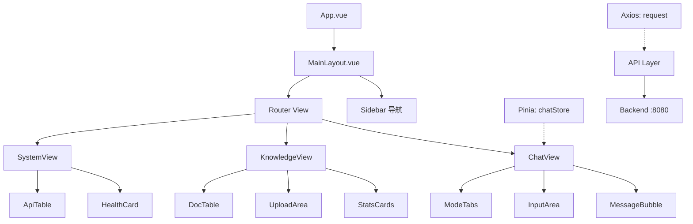

## Product Overview

基于 Spring Boot 后端 AI 知识库问答系统（RAG + Agent），构建 Vue3 前端项目，提供 AI 对话、知识库管理、系统监控三大核心页面。

## Core Features

### 1. AI 对话页面 (`/chat`)

- **双模式切换**：多轮对话模式 / Agent 工具调用模式
- **RAG 集成开关**：在多轮对话模式下可开启/关闭 RAG 检索增强
- RAG 开启时调用 `POST /ai/rag` 接口，显示引用来源（sources）
- RAG 关闭时调用 `POST /ai/chat` 接口，纯多轮对话
- **Agent 模式**：调用 `POST /ai/agent` 接口，显示调用的工具列表（toolsCalled）
- **聊天界面**：类 ChatGPT 聊天气泡布局，用户消息右对齐蓝色气泡，AI消息左对齐灰色气泡
- **消息元信息**：每条 AI 回答下方显示耗时（costMs）、Token 使用量、来源引用卡片或工具调用标签
- **会话管理**：显示 sessionId，支持新建对话和清空当前对话历史
- **发送交互**：输入框支持 Enter 发送，Shift+Enter 换行；AI 回复期间显示加载动画

### 2. 知识库管理页面 (`/knowledge`)

- **统计概览**：顶部展示文档总数和切片总数的统计卡片
- **操作按钮区**：「上传文档」+「添加文本」两个入口
- **上传功能**：点击弹出文件选择器，支持拖拽区域，仅允许 txt/pdf 格式，调用 `POST /kb/upload`
- **添加文本**：弹窗表单输入 content 和 source 字段，调用 `POST /kb/text`
- **文档列表**：Element Plus 表格展示 id、name、source、createdAt 四列
- **删除操作**：表格每行带删除按钮，确认后调用 `DELETE /kb/documents/{id}`
- **数据加载**：进入页面自动调用 `GET /kb/documents` 和 `GET /kb/stats`

### 3. 系统监控页面 (`/system`)

- **健康状态卡片**：调用 `GET /system/health`，以卡片形式展示服务状态、版本号、运行时间、内存使用、线程数、处理器数
- **API 接口列表**：调用 `GET /system/apis`，以表格形式展示所有可用 API 接口路径和描述说明

### 布局结构

左侧固定宽度侧边栏导航（Logo + 三个菜单项），右侧为内容区。侧边栏菜单项高亮当前路由。

## Tech Stack Selection

| 层次 | 技术选型 | 说明 |
| --- | --- | --- |
| 前端框架 | Vue 3 (Composition API) | 结合 TypeScript |
| 构建工具 | Vite 5 | 快速开发体验 |
| UI 组件库 | Element Plus | 与用户确认的选择 |
| CSS 方案 | 原生 CSS 变量 + Scoped Style | 无需额外 CSS 框架 |
| HTTP 客户端 | Axios | 封装统一请求层 |
| 路由 | Vue Router 4 | History 模式 |
| 状态管理 | Pinia | 管理 chat 会话状态 |


## Implementation Approach

采用标准 Vue3 SPA 项目架构，通过 Vite 脚手架初始化项目。核心设计策略：

1. **API 请求层**：封装 Axios 实例，配置 baseURL 为后端地址（默认 `http://localhost:8080`），统一处理响应拦截（解包 `Result<T>` 的 data 字段）和错误提示（ElMessage）
2. **对话状态管理**：使用 Pinia store 管理聊天消息数组、当前模式（chat/agent）、RAG 开关状态、sessionId。消息列表驱动视图渲染
3. **流式交互模拟**：由于后端返回完整结果而非 SSE 流式，前端在请求期间显示 typing 加载动画，收到响应后一次性渲染
4. **文件上传**：使用 FormData 封装 multipart 请求，配合 Element Plus 的 el-upload 组件实现拖拽上传
5. **代理配置**：Vite 配置 proxy 将 `/api` 请求转发到后端 `http://localhost:8080`，避免跨域问题

## Implementation Notes

1. **后端 API 基础路径**：后端 `application.yml` 中 `server.servlet.context-path` 为 `/`（即无前缀），前端 proxy 需直接转发到 `:8080`
2. **Result 统一封装**：后端所有接口返回 `{ code, message, data, timestamp }` 格式，前端 Axios 响应拦截需提取 `data` 字段，非 200 code 触发 ElMessage 错误提示
3. **AskRequest 字段映射**：

- 多轮对话模式：`{ question, sessionId?, useRag? }` -> 分别调用 `/ai/rag`(useRag=true) 或 `/ai/chat`(useRag=false)
- Agent 模式：`{ question, useAgent: true }` -> 调用 `/ai/agent`

4. **AskResponse 字段**：answer(回答)、sessionId(会话ID)、sources(RAG来源)、toolsCalled(Agent工具)、costMs(耗时)、tokensUsed(Token)、model(模型)
5. **KnowledgeDocument 字段**：id、name、content、source、createdAt（LocalDateTime 格式）
6. **KnowledgeStats 字段**：documentCount、chunkCount
7. **性能考虑**：消息列表使用虚拟滚动或合理分页，避免大量消息导致 DOM 性能问题；文档列表正常量级无需特殊优化

## Architecture Design

```
frontend/
├── index.html                    # HTML 入口
├── package.json                  # 项目依赖
├── vite.config.ts                # Vite 配置（proxy）
├── tsconfig.json                 # TS 配置
├── src/
│   ├── main.ts                   # 应用入口（注册插件）
│   ├── App.vue                   # 根组件（Layout 布局）
│   ├── router/
│   │   └── index.ts              # 路由定义（3个页面）
│   ├── api/
│   │   ├── request.ts            # Axios 封装 + 拦截器
│   │   ├── chat.ts               # AI 对话相关 API
│   │   ├── knowledge.ts          # 知识库相关 API
│   │   └── system.ts             # 系统监控相关 API
│   ├── stores/
│   │   └── chat.ts               # Pinia 聊天状态 Store
│   ├── types/
│   │   └── index.ts              # TypeScript 类型定义
│   ├── layouts/
│   │   └── MainLayout.vue        # 主布局（侧边栏 + 内容区）
│   └── views/
│       ├── ChatView.vue           # AI 对话页面
│       ├── KnowledgeView.vue      # 知识库管理页面
│       └── SystemView.vue         # 系统监控页面
```

### 组件关系



## Directory Structure Summary

```
c:/Users/86130/WorkBuddy/Claw/ai-knowledge-base/frontend/
├── index.html                              # [NEW] HTML 入口文件，挂载 #app
├── package.json                            # [NEW] 项目依赖配置，包含 vue/vite/element-plus/axios/pinia/vue-router
├── vite.config.ts                          # [NEW] Vite 构建配置，含 dev proxy 到 localhost:8080
├── tsconfig.json                           # [NEW] TypeScript 编译选项
├── tsconfig.node.json                      # [NEW] Node.js 环境 TS 配置
├── src/
│   ├── main.ts                             # [NEW] 应用入口，创建 Vue 实例并注册 ElementPlus/Router/Pinia
│   ├── App.vue                             # [NEW] 根组件，引入 MainLayout 作为唯一子组件
│   ├── env.d.ts                            # [NEW] 全局类型声明
│   ├── styles/
│   │   └── variables.css                   # [NEW] 全局 CSS 变量和通用样式重置
│   ├── router/
│   │   └── index.ts                        # [NEW] 路由定义：/chat, /knowledge, /system 三条路由，默认重定向到 /chat
│   ├── api/
│   │   ├── request.ts                      # [NEW] Axios 实例封装，baseURL 配置，请求/响应拦截器（解包 Result<T>，错误 ElMessage）
│   │   ├── chat.ts                         # [NEW] AI 对话 API 函数：ask/rag/chat/agent/deleteSession
│   │   ├── knowledge.ts                    # [NEW] 知识库 API 函数：uploadText/uploadFile/listDocuments/getStats/deleteDocument
│   │   └── system.ts                       # [NEW] 系统 API 函数：getHealth/getApis
│   ├── stores/
│   │   └── chat.ts                         # [NEW] Pinia Store：messages 数组/currentMode/sessionId/useRag/loading 状态及 sendMessage/clearMessages/newChat actions
│   ├── types/
│   │   └── index.ts                        # [NEW] 全局类型定义：AskRequest、AskResponse、KnowledgeDocument、KnowledgeStats、Result<T>、ChatMessage 等
│   ├── layouts/
│   │   └── MainLayout.vue                  # [NEW] 主布局组件：左侧固定宽度 220px 侧边栏（el-menu）+ 右侧自适应内容区（router-view），侧边栏含 Logo 区域和三个导航项
│   └── views/
│       ├── ChatView.vue                     # [NEW] AI 对话页面核心视图：顶部 ModeTabs 切换 + RAG 开关 + 消息列表区（滚动容器内渲染用户/AI 气泡）+ 底部 InputArea 输入框
│       ├── KnowledgeView.vue                # [NEW] 知识库管理页：顶部统计卡片（2个 el-statistic）+ 操作按钮区（el-button 上传/添加文本）+ 文档表格（el-table 展示文档列表，含删除列）
│       └── SystemView.vue                   # [NEW] 系统监控页：健康状态卡片组（el-card 展示 status/version/time/memory/threads/processors）+ API 接口表格（el-table 展示 path/description）
```

## 设计概述

采用现代科技感的企业级后台管理系统风格，整体以清爽的浅色系为主，搭配品牌蓝绿色作为主色调。界面强调专业性和功能性，同时保持视觉上的舒适感和层次感。

## 页面规划

### Page 1: AI 对话页面 (`/chat`) - 主页面

这是应用的核心页面，采用全屏对话界面设计。

**Block 1 - 顶栏控制区**
位于页面最顶部，高度约 56px，白色背景，底部细分割线。左侧显示"AI 知识库助手"标题文字，右侧排列三个控件：模式切换 Tabs（多轮对话/Agent）、RAG Switch 开关（仅多轮模式下可见）、新建对话图标按钮。

**Block 2 - 消息列表区**
占据中间大部分区域，淡灰色背景(#F5F7FA)，垂直滚动。消息按时间顺序从上到下排列。用户消息靠右显示，圆角矩形气泡，渐变蓝背景(#409EFF → #66B1FF)，白字；AI 消息靠左显示，白色背景气泡，深灰字(#303133)。AI 消息气泡内部：正文 + 可折叠的来源引用区域(RAG) 或工具调用标签链(Agent)。底部附带元信息小字：耗时、Token 数量。

**Block 3 - 底部输入区**
固定在底部，白色背景，上方阴影分隔。包含一个较大的多行文本输入框(el-input type="textarea")，右侧放置圆形蓝色发送按钮。placeholder 提示用户输入问题。输入框高度随内容自适应，最大 150px。加载中时发送按钮变为禁用旋转动画态。

### Page 2: 知识库管理页面 (`/knowledge`)

**Block 1 - 统计概览卡片区**
页面顶部横向排列两个统计卡片（el-card 内嵌 el-statistic）：文档总数(documentCount) 和切片总数(chunkCount)，分别配不同颜色图标。

**Block 2 - 操作工具栏**
统计卡片下方一行，左侧"上传文档"主按钮(Primary)、"添加文本"普通按钮(Success)。右侧可选的搜索/刷新按钮。

**Block 3 - 文档列表表格**
占据主要区域，使用 el-data-table 展示。四列：文档名称(name)、来源(source)、上传时间(createdAt 格式化显示)、操作(删除按钮)。空状态提示用户上传文档。分页器置于底部。

**Block 4 - 上传对话框**
点击"上传文档"触发 el-dialog，内含拖拽上传区域(el-upload drag)支持 txt/pdf，限制 50MB。点击"添加文本"触发另一个 el-dialog，内含 el-form 表单(content textarea + source input)，表单校验后提交。

### Page 3: 系统监控页面 (`/system`)

**Block 1 - 系统健康状态卡片组**
顶部 2x3 网格布局的六个信息卡片(el-descriptions 或独立 el-card)：服务状态(绿色UP标识)、版本号、运行时间、内存占用(进度条可视化)、活跃线程数、CPU 处理器数。每个卡片有对应的小图标和数值。

**Block 2 - API 接口清单表格**
下方一个完整的 el-table，两列：接口路径(等宽字体灰底标签样式)、接口说明(正常文字)。表格带斑马纹，清晰展示全部 11 个 API 端点。

### 全局布局 - MainLayout

左侧固定 220px 宽度的侧边栏，深色渐变背景(#1D1E2C → #2A2D3E)，顶部 Logo 区(大标题"AI KB"+副标题"Knowledge Base")，下方 el-menu 垂直导航三项：AI 对话(聊天气泡icon)、知识库管理(文件夹icon)、系统监控(仪表盘icon)。选中项高亮为品牌蓝色。右侧内容区纯白色背景，顶部面包屑或页面标题。